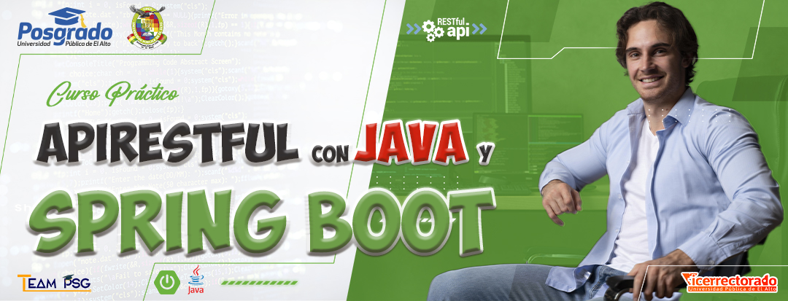

# API RESTFULL CON JAVA Y SPRING BOOT V2

## GRABACIONES - SESIONES EN VIVO

### SESIÓN 1 - 𝐂𝐔𝐑𝐒𝐎 𝐃𝐄 𝐀𝐏𝐈𝐑𝐄𝐒𝐓 𝐂𝐎𝐍 𝐒𝐏𝐑𝐈𝐍𝐆𝐁𝐎𝐎𝐓

- Preparación del Ambiente de Desarrollo
- Presentación del Proyecto

### SESIÓN 2 - 𝐂𝐔𝐑𝐒𝐎 𝐃𝐄 𝐀𝐏𝐈𝐑𝐄𝐒𝐓 𝐂𝐎𝐍  𝐒𝐏𝐑𝐈𝐍𝐆𝐁𝐎𝐎𝐓

- CRUD de ejemplo
- Inicialización del proyecto

### SESIÓN 3 - 𝐂𝐔𝐑𝐒𝐎 𝐃𝐄 𝐀𝐏𝐈𝐑𝐄𝐒𝐓 𝐂𝐎𝐍  𝐒𝐏𝐑𝐈𝐍𝐆𝐁𝐎𝐎𝐓

- GET category by ID
- GET all categories
- POST new product
- GET product by ID

### SESIÓN 4 - 𝐂𝐔𝐑𝐒𝐎 𝐃𝐄 𝐀𝐏𝐈𝐑𝐄𝐒𝐓 𝐂𝐎𝐍  𝐒𝐏𝐑𝐈𝐍𝐆𝐁𝐎𝐎𝐓

- Config application.properties to load initial data
- GET Role by name
- GET Products pageable
- GET Filtered Product and Pagination
  
### SESIÓN 5 - 𝐂𝐔𝐑𝐒𝐎 𝐃𝐄 𝐀𝐏𝐈𝐑𝐄𝐒𝐓 𝐂𝐎𝐍  𝐒𝐏𝐑𝐈𝐍𝐆𝐁𝐎𝐎𝐓

- GET user by ID
- GET all roles
- POST new order

### SESIÓN 6 - 𝐂𝐔𝐑𝐒𝐎 𝐃𝐄 𝐀𝐏𝐈𝐑𝐄𝐒𝐓 𝐂𝐎𝐍  𝐒𝐏𝐑𝐈𝐍𝐆𝐁𝐎𝐎𝐓

- GET order by ID
- Save Confirmation Token
- POST a user (Registration)

### SESIÓN 7 - 𝐂𝐔𝐑𝐒𝐎 𝐃𝐄 𝐀𝐏𝐈𝐑𝐄𝐒𝐓 𝐂𝐎𝐍  𝐒𝐏𝐑𝐈𝐍𝐆𝐁𝐎𝐎𝐓

- Implement Email Service
- Add Swagger dependency
- Initial configuration Spring Security

### SESIÓN 8 - 𝐂𝐔𝐑𝐒𝐎 𝐃𝐄 𝐀𝐏𝐈𝐑𝐄𝐒𝐓 𝐂𝐎𝐍  𝐒𝐏𝐑𝐈𝐍𝐆𝐁𝐎𝐎𝐓

- Confirm account by email
- Login
- JWT Authentication Provider

### SESIÓN 9 - 𝐂𝐔𝐑𝐒𝐎 𝐃𝐄 𝐀𝐏𝐈𝐑𝐄𝐒𝐓 𝐂𝐎𝐍  𝐒𝐏𝐑𝐈𝐍𝐆𝐁𝐎𝐎𝐓

- JWT filter
- Error handling
- Validations

### SESIÓN 10 - 𝐂𝐔𝐑𝐒𝐎 𝐃𝐄 𝐀𝐏𝐈𝐑𝐄𝐒𝐓 𝐂𝐎𝐍  𝐒𝐏𝐑𝐈𝐍𝐆𝐁𝐎𝐎𝐓

- Swagger custom configuration
- Security on paths
- Deploy